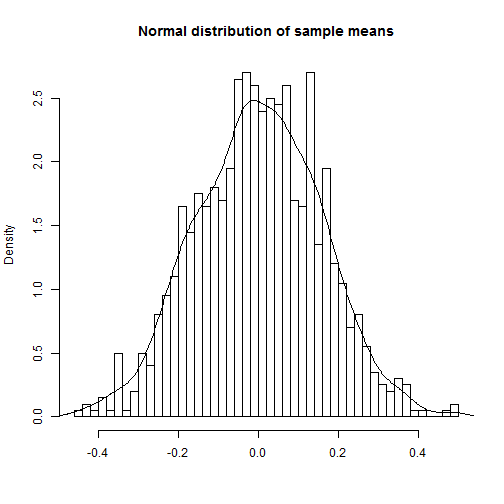

Course Project: Shiny Application and Reproducible Pitch
========================================================
author: dguedo
date: Feb 27th, 2016

Educational data product
========================================================

This is an educational data product used to illustrate the Central limit theorem, by repeatedly taking the mean of a set of random normals and plotting the results.  This application was developed 

- Bullet 1
- Bullet 2
- Bullet 3

How it works
========================================================


```r
summary(cars)
```

```
     speed           dist       
 Min.   : 4.0   Min.   :  2.00  
 1st Qu.:12.0   1st Qu.: 26.00  
 Median :15.0   Median : 36.00  
 Mean   :15.4   Mean   : 42.98  
 3rd Qu.:19.0   3rd Qu.: 56.00  
 Max.   :25.0   Max.   :120.00  
```

Histogram output
========================================================



Central limit theorem application
========================================================
- The application is hosted here: https://dguedo.shinyapps.io/Shiny_Application/
- The code can be found on github here: https://github.com/dguedo/Shiny_Application


